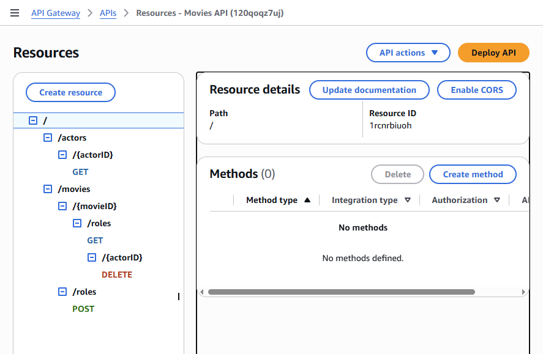
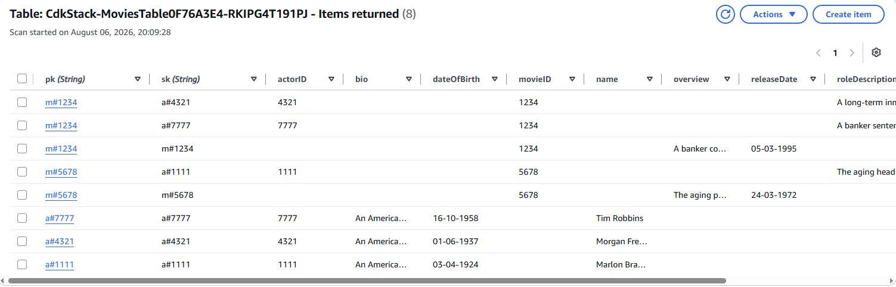

# cloud-assignment-movies

## Assignment - Cloud App Development.

**Name:** Jeremiah Casey

### Links.

**Demo:** [Add YouTube video link here]

### Screenshots.

#### App Web API

The App Web API was created using Amazon API Gateway and AWS Lambda.

The API supports the following endpoints:

- `GET /movies/{movieID}/roles`
- `GET /movies/{movieID}/roles?actor={actorID}`
- `GET /actors/{actorID}`
- `GET /actors/{actorID}?movie={movieID}`
- `POST /movies/roles`
- `DELETE /movies/{movieID}/roles/{actorID}`

Example:

---

#### DynamoDB seeded table

The application uses a single DynamoDB table.

The partition key is `pk` and the sort key is `sk`.

The following key structure is used:

Movie:

`PK = m#movieID`  
`SK = m#movieID`

Actor:

`PK = a#actorID`  
`SK = a#actorID`

Role:

`PK = m#movieID`  
`SK = a#actorID`

The table is seeded using the `seed/seed.js` script.

Example:

---

#### CloudWatch logs

AWS Lambda execution logs are available through CloudWatch.

User Activity logging was not implemented in this version of the assignment.

### Design features.

The project uses AWS CDK to provision the serverless infrastructure.

The CDK stack creates:

- An Amazon DynamoDB table.
- Four AWS Lambda functions.
- An Amazon API Gateway REST API.
- IAM permissions allowing the Lambda functions to access DynamoDB.

The Lambda functions are:

- `get-movie-roles`
- `get-actor`
- `post-role`
- `delete-role`

A single-table DynamoDB design is used to store Movie, Actor and Role data in the same table.

Lambda layers, custom L2 constructs and a multi-stack architecture were not implemented.

### Extra.

The API includes basic validation and error handling.

The POST endpoint checks that:

- `movieID`
- `actorID`
- `roleName`
- `roleDescription`

are included in the request.

It also prevents an existing movie role from being overwritten.

The DELETE endpoint returns an error if the requested role does not exist.

The API was tested using PowerShell `Invoke-RestMethod`.

Authentication using Cognito and administrator API key authentication were not implemented in this version of the assignment.